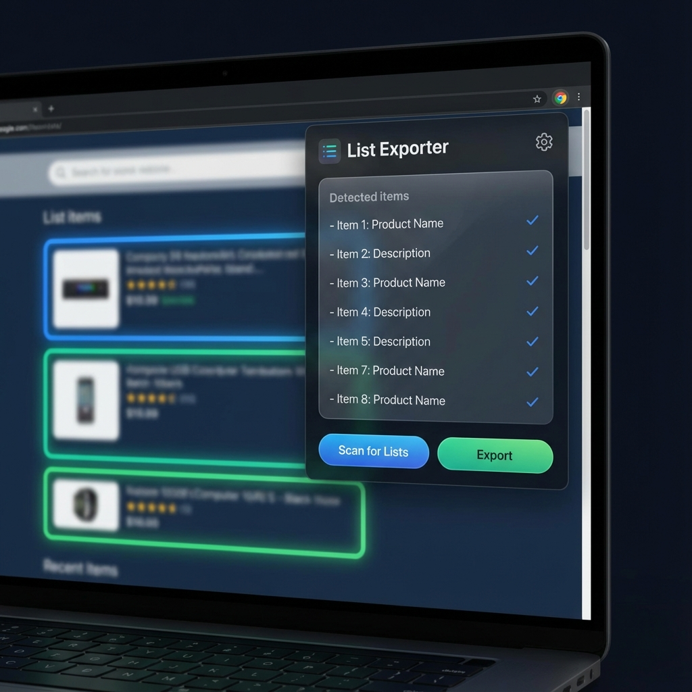

# List Exporter & Auto Screenshotter

[English](./README.md) | [简体中文](./README_zh.md)

A powerful Chrome extension designed to automate the process of extracting list-like data and capturing individual screenshots of items from any webpage. Perfect for data collection, UI/UX competitive analysis, and archival purposes.

## 🚀 Features

- **🔍 Auto-Scan**: Smarter heuristic detection of repeated elements (lists, product grids, news feeds) on any webpage.
- **🎯 Smart Highlighting**: Real-time visual feedback of the detected list items to ensure accuracy before exporting.
- **📸 Auto-Screenshot**: Automatically iterates through the selected list, scrolling each item into view and capturing a precise screenshot using `html2canvas`.
- **📊 Deep Data Extraction**: Goes beyond simple text. It captures:
    - Visible text content
    - Image URLs & Alt text
    - Links (Hrefs) & Link titles
    - Data attributes (`data-*`)
    - ARIA labels and descriptions
    - Input values
- **📦 ZIP Export**: Packages all captured images and a comprehensive metadata CSV into a single, organized ZIP file.
- **⚡ Data-Only Mode**: Need the data but not the images? Skip screenshots for a lightning-fast CSV export.

## 🛠️ Installation

1. Clone or download this repository.
2. Open Chrome and navigate to `chrome://extensions/`.
3. Enable **"Developer mode"** in the top right corner.
4. Click **"Load unpacked"** and select the project folder.

## 📖 How to Use

1. Navigate to any webpage containing a list or grid (e.g., an e-commerce site, a news feed, or a search results page).
2. Click the **List Exporter** extension icon in your toolbar.
3. Click **"Scan for Lists"**. The extension will identify potential lists on the page.
4. Click on a detected list in the popup to **highlight** it on the page for verification.
5. (Optional) Check **"仅导出数据（无截图）"** if you only need the CSV.
6. Click **"Export Selected"**. 
7. Sit back as the extension automatically scrolls and processes each item. Once finished, a ZIP file will be downloaded.

## 🏗️ Tech Stack

- **Vanilla JS & CSS**: Core extension logic and UI.
- **[html2canvas](https://html2canvas.hertzen.com/)**: For capturing webpage elements as images.
- **[JSZip](https://stuk.github.io/jszip/)**: For bundling screenshots and data into a ZIP file.

## 📄 License

MIT License. Feel free to use and contribute!
